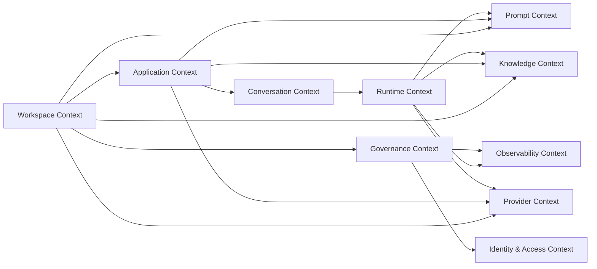
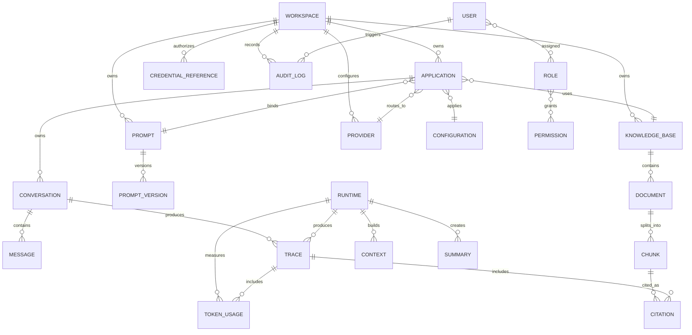
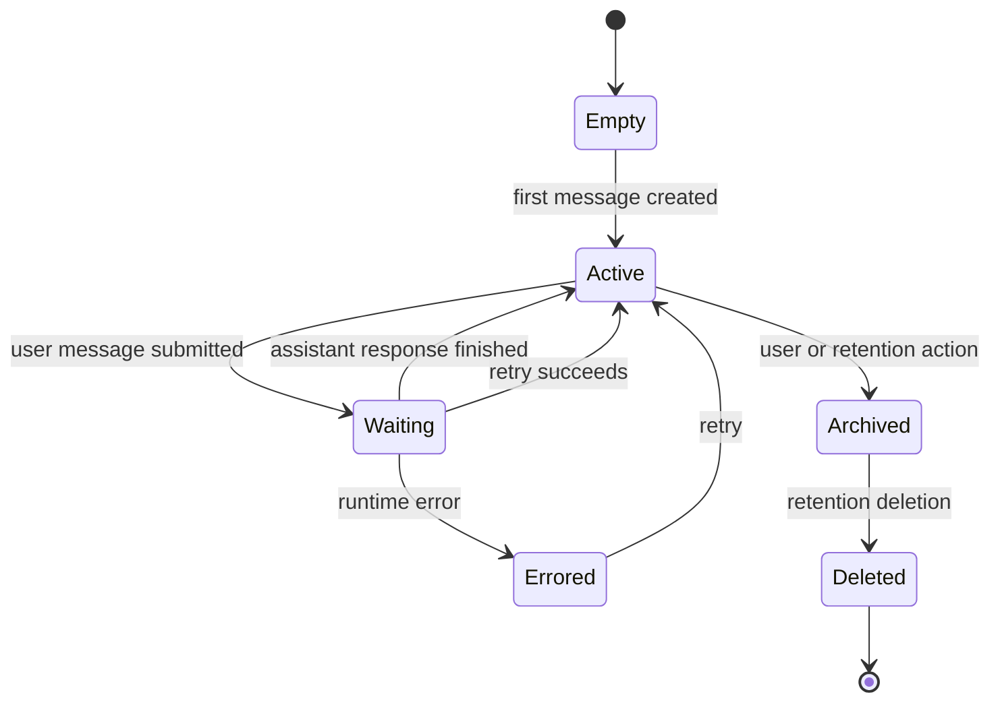
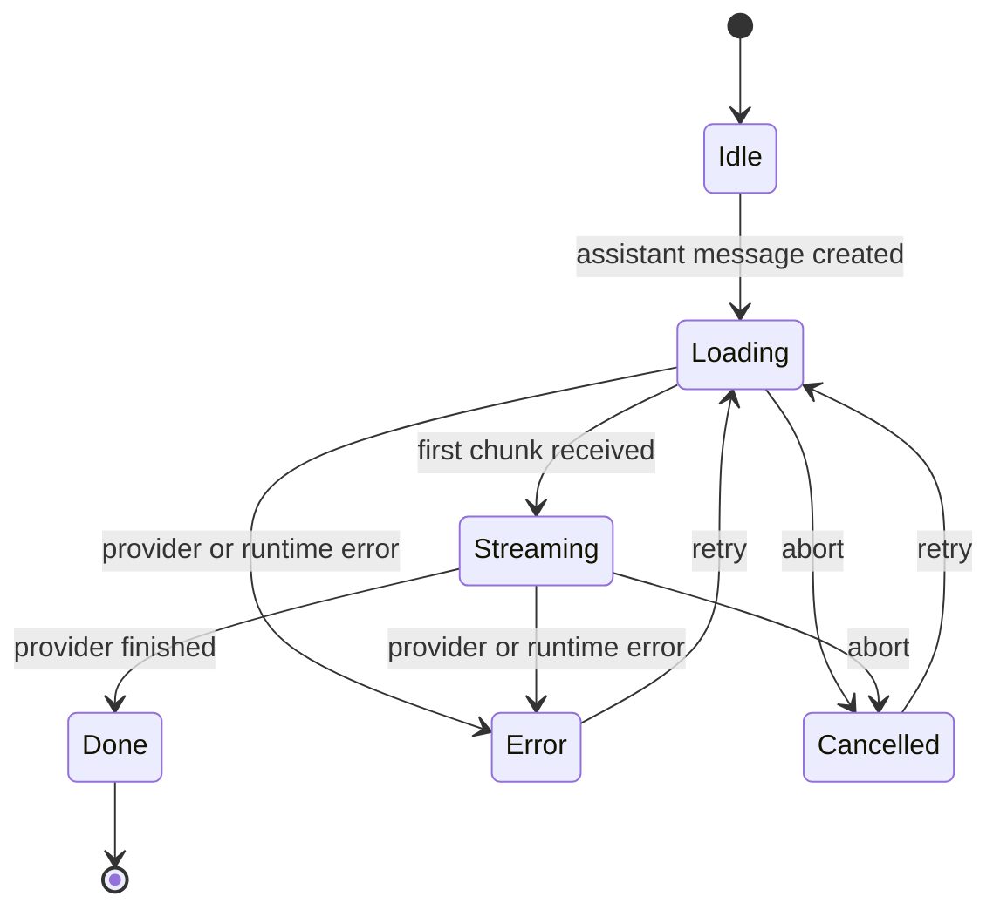
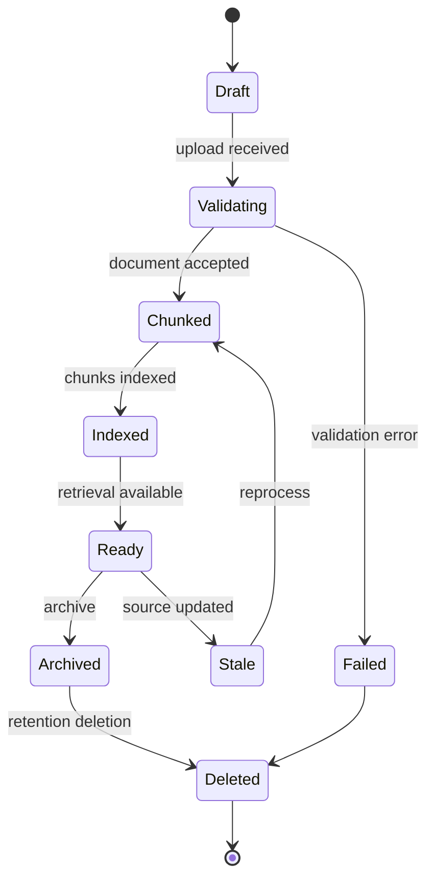
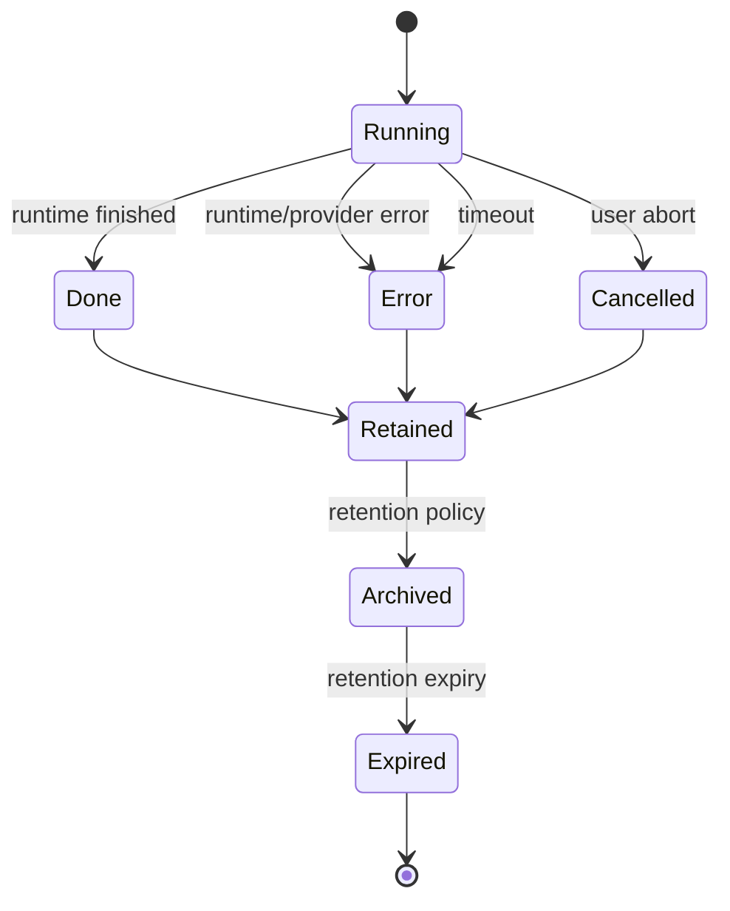
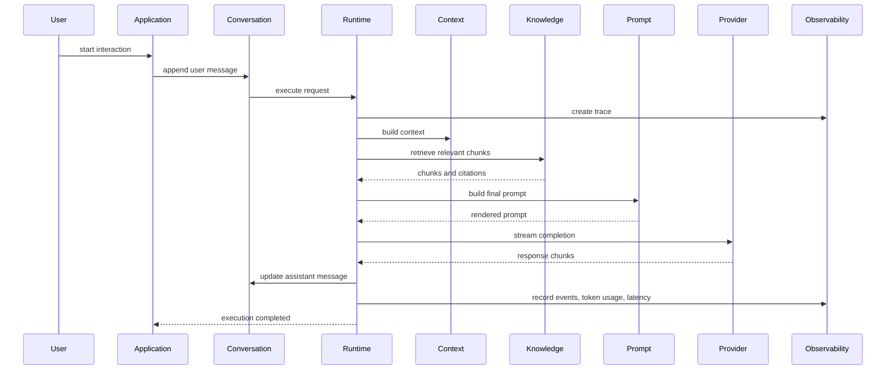

# Enterprise AI Platform Domain Model

## Vision

Enterprise AI Platform is a domain-driven platform for creating, operating, governing, and observing enterprise AI applications. Its domain model is not centered on pages, screens, frameworks, or technical widgets. It is centered on business capabilities: workspaces, applications, conversations, prompts, knowledge, providers, runtime execution, observability, and governance.

The platform exists because enterprise AI cannot be treated as a single chat box. In a real organization, AI capability is distributed across departments, teams, compliance boundaries, knowledge sources, providers, and use cases. Every AI interaction needs context, ownership, configuration, traceability, and governance.

The core domain vision is:

```text
Enterprise AI Platform
  enables organizations
  to create workspace-scoped AI applications
  that use governed prompts, knowledge, providers, and runtime policies
  while producing observable and auditable execution records.
```

The domain model must support several business goals:

- Teams can operate independently inside workspace boundaries.
- Applications represent concrete business-facing AI capabilities.
- Conversations and messages preserve the interaction record.
- Prompts are versioned business assets, not hidden implementation strings.
- Knowledge is managed as retrievable, citable enterprise content.
- Providers are configurable capabilities, not hard dependencies.
- Runtime execution is traceable and measurable.
- Governance applies across identity, permissions, credentials, configuration, and audit logs.

This document defines the domain model for that platform. It is intentionally independent of user interface and implementation technology.

## DDD Overview

Domain-Driven Design is used to prevent the platform from becoming a collection of disconnected technical services. The platform has many modules, but the domain language must remain coherent.

The highest-level domain concepts are:

```text
Workspace
  owns Applications

Application
  owns Conversations
  binds Prompt, KnowledgeBase, Provider, Configuration

Conversation
  owns Messages
  produces Runtime executions

Runtime
  produces Trace, TokenUsage, Context, Summary, Citation

Governance
  controls User, Role, Permission, CredentialReference, AuditLog
```

DDD terms used in this document:

- **Bounded Context**: a business boundary where terms have a precise meaning.
- **Aggregate Root**: the entity that protects consistency for a cluster of related objects.
- **Entity**: an object with identity and lifecycle.
- **Value Object**: immutable descriptive data without independent lifecycle.
- **Repository**: a persistence boundary for aggregate roots.
- **Factory**: a domain mechanism for creating valid aggregates.
- **Domain Service**: a business operation that does not naturally belong to one entity.
- **Domain Event**: a fact that happened in the business domain.

The platform is designed around bounded contexts so that future capabilities such as agents, workflows, tools, MCP servers, plugins, memory, and evaluations can be added without polluting the existing model.

## Bounded Contexts

### Context Map



### Core Domain

The core domain is the set of capabilities that make the product an enterprise AI platform rather than a generic admin system.

Core Domain:

- Workspace
- Application
- Conversation
- Message
- Prompt
- PromptVersion
- KnowledgeBase
- Document
- Chunk
- Retriever
- Citation
- Runtime
- Trace
- TokenUsage
- Context
- Summary

These concepts express the business value of the platform: governed AI applications that can converse, retrieve knowledge, build prompts, execute through providers, and produce observable records.

### Supporting Domains

Supporting domains enable the core domain but are not the main differentiator by themselves.

Supporting Domains:

- Provider
- CredentialReference
- Configuration
- AuditLog

Provider abstraction is important, but the platform's core value is not merely calling model vendors. Credential references and configuration are essential for production operation, and audit logs are essential for enterprise trust.

### Generic Domains

Generic domains are common enterprise platform capabilities.

Generic Domains:

- User
- Role
- Permission

These domains are necessary but not unique to AI. They should be reliable, well-governed, and integrated with workspace and application scopes.

## Domain Ownership Hierarchy

Workspace is the root domain boundary.

```text
Workspace
  -> Applications
    -> Conversations
      -> Messages
        -> Runtime Execution
          -> Trace
          -> TokenUsage
          -> Context
          -> Citations

Workspace
  -> KnowledgeBase
    -> Documents
      -> Chunks
        -> Retriever Results
          -> Citations

Workspace
  -> Prompt
    -> PromptVersions

Workspace
  -> Provider Configuration
    -> CredentialReference

Workspace
  -> Observability
    -> Traces
    -> AuditLogs
```

The ownership rule is simple:

> Every AI capability must belong to one workspace.

This rule prevents global state ambiguity. A prompt without workspace ownership is unsafe. A knowledge base without workspace ownership is dangerous. A provider credential reference without workspace ownership or organization-level policy is a governance risk. A trace without workspace and application context is hard to audit.

Applications sit below Workspace and bind assets into a business capability. A workspace may contain many applications. An application may reference one primary prompt, one or more knowledge bases, a provider configuration, and runtime configuration. Conversations belong to applications, not directly to providers or prompts.

## Enterprise Domain ER Diagram



## Domain Definitions

Each entity below is described using the same structure: definition, responsibility, lifecycle, state, ownership, relationships, dependencies, and constraints.

### Workspace

| Aspect         | Description                                                                                                                                                    |
| -------------- | -------------------------------------------------------------------------------------------------------------------------------------------------------------- |
| Definition     | A workspace is the root business boundary for AI capability. It represents a team, department, tenant, project, environment, or organizational operating unit. |
| Responsibility | Own applications, prompts, knowledge bases, provider configuration, conversations, observability scope, settings, and access rules.                            |
| Lifecycle      | Created by a platform or workspace administrator; configured; used by members; may be renamed, archived, restored, or deleted according to policy.             |
| State          | Draft, active, suspended, archived, deleted.                                                                                                                   |
| Ownership      | Owned by the organization; administered by Workspace Admins; visible to members with permission.                                                               |
| Relationships  | Has many Applications, KnowledgeBases, Prompts, Provider configurations, CredentialReferences, AuditLogs, and member role assignments.                         |
| Dependencies   | Depends on identity, access control, configuration policy, and organization governance.                                                                        |
| Constraints    | Workspace identity must be unique within the organization. All AI assets must resolve to exactly one workspace unless explicitly organization-owned.           |

Workspace is the highest-level scope that users actively switch. It is not just a folder. It is an operating boundary. When a workspace is selected, all application lists, conversations, prompts, knowledge assets, runtime settings, and traces must be scoped accordingly.

Workspace should protect teams from accidental cross-contamination. For example, a legal workspace should not accidentally retrieve HR documents. A production workspace should not silently use a development provider credential. Workspace boundaries make such separation visible and enforceable.

### Application

| Aspect         | Description                                                                                                                                                    |
| -------------- | -------------------------------------------------------------------------------------------------------------------------------------------------------------- |
| Definition     | An application is a business-facing AI capability inside a workspace.                                                                                          |
| Responsibility | Bind runtime configuration, provider routing, prompt templates, knowledge sources, conversations, and releases into one usable AI product.                     |
| Lifecycle      | Created in a workspace; configured; tested; released; monitored; iterated; archived when no longer used.                                                       |
| State          | Draft, testing, active, degraded, disabled, archived.                                                                                                          |
| Ownership      | Owned by one Workspace; may have an application owner.                                                                                                         |
| Relationships  | Belongs to Workspace; has many Conversations; references Prompt, KnowledgeBase, Provider, Configuration, and Runtime Settings.                                 |
| Dependencies   | Depends on Workspace, Provider, Prompt, KnowledgeBase, Configuration, and Governance policy.                                                                   |
| Constraints    | Must belong to one Workspace. Must have a valid runtime configuration before production use. Provider, prompt, and knowledge bindings must be workspace-valid. |

Application is the level at which AI becomes a product. A provider is not an application. A prompt is not an application. A knowledge base is not an application. An application is the composition of these assets to serve a business purpose.

Examples:

- HR Policy Assistant
- Customer Support Copilot
- Legal Contract Review Assistant
- Engineering Documentation Helper
- Operations Incident Analyst

Application is also the primary unit for release management. A future release may include prompt version, provider choice, runtime configuration, knowledge binding, and safety policy.

### Conversation

| Aspect         | Description                                                                                                                                        |
| -------------- | -------------------------------------------------------------------------------------------------------------------------------------------------- |
| Definition     | A conversation is a sequence of user and assistant messages for one application interaction.                                                       |
| Responsibility | Preserve interaction history, message order, user intent, assistant responses, citations, and trace links.                                         |
| Lifecycle      | Created when a user starts an interaction; accumulates messages; may be summarized, archived, exported, or deleted according to retention policy.  |
| State          | Empty, active, waiting, completed, errored, archived, deleted.                                                                                     |
| Ownership      | Owned by one Application; scoped by Workspace.                                                                                                     |
| Relationships  | Contains Messages; produces Runtime executions; links to Traces; may include Citations through assistant messages.                                 |
| Dependencies   | Depends on Application, User, Runtime, Message, Trace, and retention policy.                                                                       |
| Constraints    | Message order must be preserved. Conversation scope must not cross applications or workspaces. Conversation deletion must follow retention policy. |

Conversation is the business record of AI interaction. It should remain understandable to non-engineers. It answers what was asked, what was answered, and what sources were used.

Conversation is also a runtime input. Context building uses conversation history to prepare model input. Because conversation history can grow, it interacts with Context and Summary domains.

### Message

| Aspect         | Description                                                                                                                                                |
| -------------- | ---------------------------------------------------------------------------------------------------------------------------------------------------------- |
| Definition     | A message is a single utterance in a conversation. It may be produced by a user, assistant, or system.                                                     |
| Responsibility | Store content, role, lifecycle status, token usage, citations, metadata, and trace association.                                                            |
| Lifecycle      | Created; may stream; may finish; may error; may be cancelled; may be summarized or hidden from visible conversation depending on context strategy.         |
| State          | Idle, loading, streaming, done, error, cancelled.                                                                                                          |
| Ownership      | Owned by one Conversation.                                                                                                                                 |
| Relationships  | Belongs to Conversation; may reference Trace; assistant messages may include Citations and TokenUsage; system messages may represent prompts or summaries. |
| Dependencies   | Depends on Conversation, Runtime, Citation, TokenUsage, and Context.                                                                                       |
| Constraints    | Must preserve role and order. Assistant streaming updates must follow valid state transitions. Message content must respect retention and privacy rules.   |

Message state is critical because AI responses are not atomic. Streaming means a message may exist before its full content is available. Error and cancellation states must be explicit so users and auditors can understand incomplete responses.

### Prompt

| Aspect         | Description                                                                                                                          |
| -------------- | ------------------------------------------------------------------------------------------------------------------------------------ |
| Definition     | A prompt is a managed instruction asset used to construct model input.                                                               |
| Responsibility | Define reusable templates, variables, system behavior, RAG instructions, and application-specific model guidance.                    |
| Lifecycle      | Created; edited; previewed; versioned; reviewed; published; deprecated; archived.                                                    |
| State          | Draft, review, published, deprecated, archived.                                                                                      |
| Ownership      | Owned by Workspace; may be bound to Applications.                                                                                    |
| Relationships  | Has many PromptVersions; used by Application; rendered by Runtime; may reference Knowledge and Context variables.                    |
| Dependencies   | Depends on Workspace, PromptVersion, Configuration, and Governance policy.                                                           |
| Constraints    | Must define required variables. Published prompts should be immutable. Prompt usage must be traceable to version for production use. |

Prompt is a first-class domain object. It should not be treated as incidental text. In enterprise systems, prompts encode business policy, tone, safety rules, formatting expectations, and tool usage behavior.

### PromptVersion

| Aspect         | Description                                                                                                                            |
| -------------- | -------------------------------------------------------------------------------------------------------------------------------------- |
| Definition     | A prompt version is an immutable snapshot of a prompt at a point in time.                                                              |
| Responsibility | Preserve prompt content, variable contract, author, timestamp, status, and release metadata.                                           |
| Lifecycle      | Created from draft; reviewed; published; used; superseded; deprecated.                                                                 |
| State          | Draft, review, approved, published, superseded, deprecated.                                                                            |
| Ownership      | Owned by Prompt; scoped by Workspace.                                                                                                  |
| Relationships  | Belongs to Prompt; may be referenced by Application release; may be linked to Traces.                                                  |
| Dependencies   | Depends on Prompt, User, AuditLog, and approval policy.                                                                                |
| Constraints    | Published versions must not be mutated. Runtime traces should record the prompt version used when production traceability is required. |

PromptVersion enables safe iteration. Without versions, teams cannot reliably answer why an AI response changed.

### KnowledgeBase

| Aspect         | Description                                                                                                                              |
| -------------- | ---------------------------------------------------------------------------------------------------------------------------------------- |
| Definition     | A knowledge base is a workspace-scoped collection of documents prepared for retrieval.                                                   |
| Responsibility | Organize documents, produce chunks, support retrieval, generate citations, and provide knowledge context to runtime.                     |
| Lifecycle      | Created; populated with documents; indexed; queried; refreshed; archived; deleted.                                                       |
| State          | Empty, indexing, ready, degraded, archived, deleted.                                                                                     |
| Ownership      | Owned by Workspace; may be bound to Applications.                                                                                        |
| Relationships  | Contains Documents and Chunks; used by Retriever; produces Citations; referenced by Application.                                         |
| Dependencies   | Depends on Workspace, Document, Chunk, Retriever, Citation, retention policy, and future indexing infrastructure.                        |
| Constraints    | Must be workspace-scoped. Retrieval must not cross workspace boundaries. Document size, chunk size, and retrieval topK must be governed. |

KnowledgeBase is the business domain for RAG. It is not a file upload utility. It represents the enterprise knowledge surface available to AI applications.

### Document

| Aspect         | Description                                                                                                                             |
| -------------- | --------------------------------------------------------------------------------------------------------------------------------------- |
| Definition     | A document is a source artifact added to a knowledge base.                                                                              |
| Responsibility | Store source title, content, metadata, ownership, creation time, and lifecycle status.                                                  |
| Lifecycle      | Uploaded or imported; validated; chunked; indexed; queried; updated; expired; archived; deleted.                                        |
| State          | Draft, validating, chunked, indexed, failed, expired, archived, deleted.                                                                |
| Ownership      | Owned by KnowledgeBase; scoped by Workspace.                                                                                            |
| Relationships  | Belongs to KnowledgeBase; splits into Chunks; source for Citations.                                                                     |
| Dependencies   | Depends on KnowledgeBase, validation policy, document processing, and retention rules.                                                  |
| Constraints    | Must not exceed size limits. Must not be visible outside owning workspace. Sensitive documents may require classification and approval. |

Document is the source of truth for retrieved knowledge. Citations should ultimately trace back to documents.

### Chunk

| Aspect         | Description                                                                                                                 |
| -------------- | --------------------------------------------------------------------------------------------------------------------------- |
| Definition     | A chunk is a retrievable segment of a document.                                                                             |
| Responsibility | Store segmented content, keywords or embedding metadata, score during retrieval, and source document association.           |
| Lifecycle      | Generated from document; indexed; retrieved; cited; regenerated when source document changes; deleted with source document. |
| State          | Generated, indexed, stale, deleted.                                                                                         |
| Ownership      | Owned by Document; scoped by KnowledgeBase and Workspace.                                                                   |
| Relationships  | Belongs to Document; retrieved by Retriever; may produce Citation.                                                          |
| Dependencies   | Depends on Document, chunking strategy, retrieval strategy, and indexing policy.                                            |
| Constraints    | Must preserve source identity. Chunk size must be bounded. Chunk retrieval must be workspace-scoped.                        |

Chunks are implementation-facing but still domain-relevant because citation quality depends on chunk quality.

### Retriever

| Aspect         | Description                                                                                                                            |
| -------------- | -------------------------------------------------------------------------------------------------------------------------------------- |
| Definition     | Retriever is a domain service that selects relevant chunks for a query.                                                                |
| Responsibility | Accept query input, search knowledge chunks, score results, enforce limits, and return ranked candidates.                              |
| Lifecycle      | Invoked during retrieval tests or runtime execution; does not persist as an entity.                                                    |
| State          | Stateless service; may use configured retrieval parameters.                                                                            |
| Ownership      | Owned by Knowledge Context; operates within Workspace and KnowledgeBase boundaries.                                                    |
| Relationships  | Uses KnowledgeBase and Chunks; produces retrieval results used by Citation and Runtime.                                                |
| Dependencies   | Depends on retrieval strategy, query processing, chunk metadata, and future vector infrastructure.                                     |
| Constraints    | Must enforce topK limits, workspace boundaries, score caps, and query validation. Must not retrieve from unauthorized knowledge bases. |

Retriever is a domain service, not an aggregate root. It exists because retrieval behavior spans KnowledgeBase, Chunk, query input, scoring, and runtime needs.

### Citation

| Aspect         | Description                                                                                                                       |
| -------------- | --------------------------------------------------------------------------------------------------------------------------------- |
| Definition     | A citation is a reference from an assistant response to a knowledge source.                                                       |
| Responsibility | Preserve source title, source content excerpt, score, and association to retrieved chunks or documents.                           |
| Lifecycle      | Created from retrieval results during runtime; attached to assistant message; viewed; exported; retained with conversation/trace. |
| State          | Generated, attached, hidden, deleted through retention.                                                                           |
| Ownership      | Owned by Message or Trace; sourced from KnowledgeBase.                                                                            |
| Relationships  | References Chunk and Document; attached to assistant Message; included in Trace.                                                  |
| Dependencies   | Depends on Retriever, Chunk, Document, Message, and Runtime.                                                                      |
| Constraints    | Must not cite unauthorized documents. Citation content should be bounded and source-identifiable.                                 |

Citation is a trust artifact. It helps users understand why an answer was generated and where supporting knowledge came from.

### Provider

| Aspect         | Description                                                                                                                            |
| -------------- | -------------------------------------------------------------------------------------------------------------------------------------- |
| Definition     | A provider represents an AI model vendor or execution backend.                                                                         |
| Responsibility | Declare supported models, capabilities, limits, cost tier, streaming support, and normalized error behavior.                           |
| Lifecycle      | Registered; configured; tested; enabled; disabled; deprecated.                                                                         |
| State          | Available, configured, healthy, degraded, disabled, unsupported.                                                                       |
| Ownership      | May be organization-available and workspace-configured; used by Applications and Runtime.                                              |
| Relationships  | Uses CredentialReference; selected by Application; called by Runtime; produces provider-specific errors normalized into domain errors. |
| Dependencies   | Depends on provider policy, credential references, configuration, and network/backend gateway in production.                           |
| Constraints    | Runtime must depend on provider contract, not vendor implementation. Provider must declare capabilities and enforce configured limits. |

Provider is a supporting domain. It is crucial for extensibility, but the platform should not be vendor-shaped.

### CredentialReference

| Aspect         | Description                                                                                                     |
| -------------- | --------------------------------------------------------------------------------------------------------------- |
| Definition     | A credential reference is a safe pointer to managed secret material. It is not the secret itself.               |
| Responsibility | Identify which managed credential should be used without exposing raw keys to runtime or UI-facing domains.     |
| Lifecycle      | Created by authorized administrator; validated; assigned; rotated; disabled; deleted.                           |
| State          | Active, pending, expired, disabled, revoked.                                                                    |
| Ownership      | Owned by Governance or Provider Context; scoped by Organization, Workspace, or Application depending on policy. |
| Relationships  | Used by Provider; referenced by Configuration; audited through AuditLog.                                        |
| Dependencies   | Depends on credential vault or gateway, security policy, and audit system.                                      |
| Constraints    | Must not contain raw API keys. Must be auditable. Must not be accessible outside authorized scope.              |

CredentialReference is one of the most important production security concepts. It allows provider configuration without leaking secrets into runtime logic.

### Runtime

| Aspect         | Description                                                                                                                                     |
| -------------- | ----------------------------------------------------------------------------------------------------------------------------------------------- |
| Definition     | Runtime is the execution domain that turns conversation input into provider output through context, knowledge, prompt, and configuration.       |
| Responsibility | Orchestrate context building, knowledge retrieval, prompt construction, provider execution, streaming lifecycle, state transitions, and events. |
| Lifecycle      | Invoked per request; starts; streams; finishes, errors, aborts, or times out; produces trace and token usage.                                   |
| State          | Idle, loading, streaming, done, error, cancelled.                                                                                               |
| Ownership      | Owned by Application execution; scoped by Workspace and Conversation.                                                                           |
| Relationships  | Uses Conversation, Message, Context, Summary, KnowledgeBase, Prompt, Provider, Configuration, Trace, and TokenUsage.                            |
| Dependencies   | Depends on provider contract, prompt engine, context manager, retriever, configuration, and runtime guardrails.                                 |
| Constraints    | Must enforce state transitions, timeouts, retry limits, token limits, provider limits, and configuration validity.                              |

Runtime is the core orchestration domain. It is not merely an API call. It is a controlled execution pipeline.

### Trace

| Aspect         | Description                                                                                                                        |
| -------------- | ---------------------------------------------------------------------------------------------------------------------------------- |
| Definition     | A trace is an execution record for one runtime request.                                                                            |
| Responsibility | Capture request identity, provider, model, status, start time, end time, duration, events, tokens, latency, and error information. |
| Lifecycle      | Created at runtime start; updated during execution; completed on finish/error/abort; retained or trimmed by policy.                |
| State          | Running, done, error, cancelled, expired, archived.                                                                                |
| Ownership      | Owned by Runtime execution; scoped by Conversation, Application, and Workspace.                                                    |
| Relationships  | Belongs to Conversation/Application/Workspace; includes TokenUsage, events, latency metrics, and citations.                        |
| Dependencies   | Depends on Runtime events, Observability policy, retention policy, and AuditLog integration.                                       |
| Constraints    | Trace volume must be bounded. Sensitive payloads should be summarized or redacted. Trace must preserve enough context for audit.   |

Trace makes runtime behavior observable and accountable.

### TokenUsage

| Aspect         | Description                                                                                            |
| -------------- | ------------------------------------------------------------------------------------------------------ |
| Definition     | TokenUsage records prompt, completion, and total token estimates or counts.                            |
| Responsibility | Measure usage for cost, capacity, debugging, and context management.                                   |
| Lifecycle      | Estimated before or during runtime; finalized after provider response; aggregated for reports.         |
| State          | Estimated, finalized, aggregated, expired.                                                             |
| Ownership      | Owned by Trace; may be aggregated by Application, Workspace, Provider, or Organization.                |
| Relationships  | Belongs to Trace; influenced by Message, Context, Summary, Prompt, and Provider.                       |
| Dependencies   | Depends on token estimator or provider-reported usage.                                                 |
| Constraints    | Must distinguish prompt and completion usage. Must remain bounded and associated with trace and scope. |

TokenUsage is not only a technical metric. It is part of cost governance and runtime safety.

### Context

| Aspect         | Description                                                                                                                        |
| -------------- | ---------------------------------------------------------------------------------------------------------------------------------- |
| Definition     | Context is the selected message/history/system information used to construct model input.                                          |
| Responsibility | Preserve relevant conversation history while respecting context window and compression strategy.                                   |
| Lifecycle      | Built during runtime; may be trimmed, summarized, or passed through; recorded in lightweight trace metadata.                       |
| State          | Full, windowed, summarized, hybrid, invalid.                                                                                       |
| Ownership      | Owned by Runtime execution; sourced from Conversation and Configuration.                                                           |
| Relationships  | Uses Messages and Summary; affects Prompt construction and TokenUsage.                                                             |
| Dependencies   | Depends on conversation history, token estimation, runtime configuration, and provider context limits.                             |
| Constraints    | Must preserve system prompt and latest user message. Must not exceed context limits. Must not leak across conversation boundaries. |

Context controls the scalability of long conversations.

### Summary

| Aspect         | Description                                                                                                                   |
| -------------- | ----------------------------------------------------------------------------------------------------------------------------- |
| Definition     | A summary is a compressed representation of older conversation history.                                                       |
| Responsibility | Reduce context size while preserving important historical intent.                                                             |
| Lifecycle      | Created when context exceeds window; reused or regenerated; may be stored as system-level context; expires with conversation. |
| State          | Generated, stale, active, discarded.                                                                                          |
| Ownership      | Owned by Conversation or Runtime execution depending on persistence policy.                                                   |
| Relationships  | Derived from Messages; used by Context; may appear as system message.                                                         |
| Dependencies   | Depends on compression strategy and token limits.                                                                             |
| Constraints    | Must not replace latest user message. Must preserve safety-critical system instructions.                                      |

Summary is a supporting object for context management. It allows long conversations to remain useful.

### Configuration

| Aspect         | Description                                                                                                                        |
| -------------- | ---------------------------------------------------------------------------------------------------------------------------------- |
| Definition     | Configuration is a governed set of runtime, provider, prompt, and knowledge settings.                                              |
| Responsibility | Control AI behavior through validated parameters rather than hardcoded implementation.                                             |
| Lifecycle      | Created from defaults; modified; validated; applied; versioned; exported; imported; reset; archived.                               |
| State          | Draft, valid, invalid, applied, deprecated, reset.                                                                                 |
| Ownership      | Owned by Workspace or Application; may inherit organization defaults.                                                              |
| Relationships  | References Provider, CredentialReference, Prompt, KnowledgeBase, Runtime limits, and Governance policies.                          |
| Dependencies   | Depends on validation schema, policy, workspace/application scope, and audit logging.                                              |
| Constraints    | Invalid configuration must be rejected. Defaults must be safe. Configuration changes should be auditable and may require approval. |

Configuration is the control surface for AI behavior. It should be validated before it affects runtime.

### User

| Aspect         | Description                                                                                                       |
| -------------- | ----------------------------------------------------------------------------------------------------------------- |
| Definition     | A user is a human actor or service identity that interacts with the platform.                                     |
| Responsibility | Represent identity, profile, membership, role assignments, and audit actor.                                       |
| Lifecycle      | Invited or provisioned; activated; assigned roles; suspended; deactivated; deleted according to policy.           |
| State          | Invited, active, suspended, disabled, deleted.                                                                    |
| Ownership      | Owned by Organization identity context; may be member of many Workspaces.                                         |
| Relationships  | Has Roles and Permissions; creates Conversations; modifies Prompts, Knowledge, Configuration; triggers AuditLogs. |
| Dependencies   | Depends on identity provider, RBAC, workspace membership, and audit policy.                                       |
| Constraints    | User actions must be permission-checked and auditable.                                                            |

User is a generic domain but critical for governance.

### Role

| Aspect         | Description                                                                                      |
| -------------- | ------------------------------------------------------------------------------------------------ |
| Definition     | A role is a named collection of permissions assigned to users in a scope.                        |
| Responsibility | Simplify access control by grouping permissions into business responsibilities.                  |
| Lifecycle      | Created; assigned; modified; deprecated; removed.                                                |
| State          | Active, deprecated, disabled.                                                                    |
| Ownership      | Owned by Organization or Workspace depending on policy.                                          |
| Relationships  | Has Permissions; assigned to Users; may be scoped to Workspace or Application.                   |
| Dependencies   | Depends on RBAC policy and governance.                                                           |
| Constraints    | Role changes must be audited. High-privilege roles should require restricted access or approval. |

Roles should map to business responsibilities such as Workspace Admin, Prompt Engineer, Knowledge Manager, Auditor, and Viewer.

### Permission

| Aspect         | Description                                                                                                         |
| -------------- | ------------------------------------------------------------------------------------------------------------------- |
| Definition     | A permission is an atomic capability granted to a role or user.                                                     |
| Responsibility | Control access to pages, actions, fields, data scopes, and domain operations.                                       |
| Lifecycle      | Defined by platform; assigned through roles; evaluated during access checks; deprecated when no longer needed.      |
| State          | Active, deprecated.                                                                                                 |
| Ownership      | Owned by Identity & Access Context.                                                                                 |
| Relationships  | Belongs to Roles; evaluated against Users and domain scopes.                                                        |
| Dependencies   | Depends on RBAC model and domain operation catalog.                                                                 |
| Constraints    | Permissions must be specific enough to control sensitive AI operations such as provider changes and prompt publish. |

Permissions are the bridge between identity and domain operations.

### AuditLog

| Aspect         | Description                                                                                                                            |
| -------------- | -------------------------------------------------------------------------------------------------------------------------------------- |
| Definition     | An audit log is an immutable record of a significant domain action.                                                                    |
| Responsibility | Preserve actor, action, target, scope, timestamp, before/after summary, and outcome.                                                   |
| Lifecycle      | Created when auditable event occurs; retained; searched; exported; expired according to policy.                                        |
| State          | Recorded, retained, exported, expired, sealed.                                                                                         |
| Ownership      | Owned by Governance Context; scoped by Organization, Workspace, Application, or entity.                                                |
| Relationships  | References User, Workspace, Application, Configuration, PromptVersion, CredentialReference, Document, Provider, or Trace.              |
| Dependencies   | Depends on domain events, retention policy, and compliance requirements.                                                               |
| Constraints    | Must be immutable. Must not expose raw secrets. Must contain enough information for accountability without storing excessive payloads. |

AuditLog is the enterprise memory of platform changes.

## Lifecycle Diagrams

### Conversation Lifecycle



Conversation lifecycle is driven by user interaction and runtime execution. A conversation may have multiple runtime requests, and each request may produce a trace.

### Message Lifecycle



Message lifecycle must be explicit because streaming responses are partial for a period of time. A message that is cancelled or errored should remain visible as evidence of what happened.

### Document Lifecycle



Document lifecycle must enforce validation, size constraints, workspace ownership, and eventual indexing status.

### Trace Lifecycle



Trace lifecycle is append-only from the business perspective. Trace records should not be edited after completion, though retention policy may trim or archive them.

## Runtime Sequence



This sequence represents domain behavior, not implementation. It shows that runtime is an orchestrator that coordinates context, knowledge, prompt, provider, and observability.

## Aggregate Roots

Aggregate roots protect consistency boundaries.

### Workspace Aggregate

Root:

- Workspace

Entities inside or referenced by the aggregate:

- Workspace settings
- Workspace membership summary
- Workspace asset references

Invariants:

- Workspace identity must be unique.
- Workspace must control its asset scope.
- Workspace deletion or archival must handle applications, prompts, knowledge bases, and traces according to retention policy.

Repository:

- WorkspaceRepository

Factory:

- WorkspaceFactory creates a workspace with valid default settings and ownership metadata.

### Application Aggregate

Root:

- Application

Entities and references:

- Application configuration reference
- Prompt binding
- Knowledge binding
- Provider binding
- Release metadata

Invariants:

- Application must belong to one workspace.
- Application cannot bind assets outside its workspace unless policy allows shared assets.
- Active application must have valid runtime configuration.

Repository:

- ApplicationRepository

Factory:

- ApplicationFactory creates application with safe defaults.

### Conversation Aggregate

Root:

- Conversation

Entities:

- Message
- Citation references
- Trace references

Invariants:

- Messages must preserve order.
- Message state transitions must be valid.
- Conversation must belong to one application.

Repository:

- ConversationRepository

Factory:

- ConversationFactory creates an empty or first-message conversation under an application.

### Prompt Aggregate

Root:

- Prompt

Entities:

- PromptVersion

Invariants:

- Published versions are immutable.
- Prompt variables must match the template contract.
- Prompt belongs to one workspace.

Repository:

- PromptRepository

Factory:

- PromptFactory creates prompt with initial draft version.

### KnowledgeBase Aggregate

Root:

- KnowledgeBase

Entities:

- Document
- Chunk

Invariants:

- Documents and chunks must stay inside workspace scope.
- Chunk size and document size must respect policy.
- Retrieval must not cross unauthorized knowledge bases.

Repository:

- KnowledgeBaseRepository

Factory:

- KnowledgeBaseFactory creates an empty knowledge base with chunking and retrieval policy defaults.

### Provider Configuration Aggregate

Root:

- Provider

Entities and value references:

- CredentialReference
- ProviderCapabilities
- Provider model list

Invariants:

- Provider must declare capabilities.
- Raw credentials must not be stored as configuration.
- Provider configuration must be valid before runtime uses it.

Repository:

- ProviderRepository

Factory:

- ProviderConfigFactory creates provider configuration from safe defaults and credential references.

### Trace Aggregate

Root:

- Trace

Entities and value objects:

- TokenUsage
- Runtime events
- Latency metrics
- Citation references

Invariants:

- Trace must belong to a runtime execution.
- Trace status must eventually resolve from running to terminal state.
- Trace retention must be bounded by policy.

Repository:

- TraceRepository

Factory:

- TraceFactory creates trace at runtime start.

## Repositories

Repositories are responsible for retrieving and persisting aggregate roots. They should not expose internal aggregate mutation details as arbitrary operations.

Recommended repositories:

| Repository              | Aggregate Root | Responsibility                                        |
| ----------------------- | -------------- | ----------------------------------------------------- |
| WorkspaceRepository     | Workspace      | Store workspace identity, metadata, and scope.        |
| ApplicationRepository   | Application    | Store AI application definitions and bindings.        |
| ConversationRepository  | Conversation   | Store conversations, messages, and trace references.  |
| PromptRepository        | Prompt         | Store prompts and prompt versions.                    |
| KnowledgeRepository     | KnowledgeBase  | Store knowledge bases, documents, and chunks.         |
| ProviderRepository      | Provider       | Store provider configuration and capability metadata. |
| TraceRepository         | Trace          | Store traces and observability records.               |
| ConfigurationRepository | Configuration  | Store validated workspace/application configuration.  |
| AuditLogRepository      | AuditLog       | Store immutable audit events.                         |
| IdentityRepository      | User, Role     | Store identity and access control data.               |

Repository operations should preserve domain language. For example, a repository should support retrieving conversations by application or traces by conversation, because those are meaningful domain queries.

## Factories

Factories create valid domain objects and enforce creation-time invariants.

Recommended factories:

- WorkspaceFactory
- ApplicationFactory
- ConversationFactory
- MessageFactory
- PromptFactory
- PromptVersionFactory
- KnowledgeBaseFactory
- DocumentFactory
- ChunkFactory
- CitationFactory
- ProviderConfigFactory
- CredentialReferenceFactory
- TraceFactory
- ConfigurationFactory
- AuditLogFactory

Factories are especially important for:

- Ensuring workspace ownership is set.
- Ensuring application bindings are valid.
- Ensuring prompts start with valid variable contracts.
- Ensuring documents meet validation policy.
- Ensuring trace starts with required identifiers.
- Ensuring credential references do not contain raw secrets.

## Value Objects

Value objects describe attributes without independent lifecycle.

Recommended value objects:

| Value Object         | Description                                                      |
| -------------------- | ---------------------------------------------------------------- |
| WorkspaceId          | Stable identifier for workspace scope.                           |
| ApplicationId        | Stable identifier for application scope.                         |
| ConversationId       | Stable identifier for conversation.                              |
| MessageId            | Stable identifier for message.                                   |
| TraceId              | Stable identifier for runtime execution record.                  |
| ProviderName         | Name of provider such as mock, openai, claude, qwen, deepseek.   |
| ModelName            | Model identifier within provider.                                |
| ProviderCapabilities | Streaming support, token limit, context limit, and cost tier.    |
| CredentialRef        | Safe reference to external secret.                               |
| TokenCount           | Numeric token measure with category.                             |
| ContextWindow        | Maximum allowed context size.                                    |
| CompressionStrategy  | Context handling strategy such as none, window, summary, hybrid. |
| RetrievalScore       | Bounded score for chunk relevance.                               |
| CitationSource       | Source title or document reference.                              |
| PermissionCode       | Atomic permission identifier.                                    |
| AuditTarget          | Typed reference to audited entity.                               |
| RetentionPolicy      | Rules for how long domain records are retained.                  |

Value objects should be immutable and comparable by value.

## Domain Services

Domain services coordinate behavior that spans multiple entities.

### RuntimeExecutionService

Responsibility:

- Execute conversation request through context, knowledge, prompt, provider, and observability.

Uses:

- Conversation
- Context
- KnowledgeBase
- Prompt
- Provider
- Trace
- TokenUsage

Constraints:

- Must enforce runtime guards.
- Must produce trace.
- Must respect workspace and application scope.

### ContextManagementService

Responsibility:

- Build valid context under token and provider limits.

Uses:

- Conversation
- Message
- Summary
- Configuration

Constraints:

- Preserve system prompt and latest user message.
- Apply compression strategy safely.

### RetrievalService

Responsibility:

- Retrieve relevant chunks and produce citation candidates.

Uses:

- KnowledgeBase
- Document
- Chunk
- Retriever
- Citation

Constraints:

- Enforce workspace boundary.
- Enforce topK and score limits.

### PromptRenderingService

Responsibility:

- Render prompt versions with variables, context, knowledge, and user input.

Uses:

- Prompt
- PromptVersion
- Context
- Citation

Constraints:

- Validate required variables.
- Preserve prompt version traceability.

### ProviderRoutingService

Responsibility:

- Resolve provider, model, credential reference, and provider capabilities for an application.

Uses:

- Provider
- CredentialReference
- Configuration
- Application

Constraints:

- No raw secrets.
- Provider must be allowed by policy.

### ConfigurationValidationService

Responsibility:

- Validate configuration before it affects runtime.

Uses:

- Configuration
- Provider capabilities
- Governance policy

Constraints:

- Reject invalid config.
- Provide safe defaults.
- Produce audit-worthy change summaries.

### AuditService

Responsibility:

- Record significant domain changes.

Uses:

- User
- Workspace
- Application
- Prompt
- KnowledgeBase
- Configuration
- CredentialReference
- Trace

Constraints:

- Logs must be immutable.
- Raw secrets must not be stored.

## Domain Events

Important domain events include:

- WorkspaceCreated
- WorkspaceRenamed
- WorkspaceArchived
- ApplicationCreated
- ApplicationConfigured
- ConversationStarted
- MessageCreated
- MessageStreamStarted
- MessageCompleted
- MessageFailed
- MessageCancelled
- PromptCreated
- PromptVersionPublished
- KnowledgeBaseCreated
- DocumentUploaded
- DocumentChunked
- RetrievalExecuted
- CitationGenerated
- ProviderChanged
- CredentialReferenceUpdated
- RuntimeStarted
- RuntimeContextBuilt
- RuntimeKnowledgeRetrieved
- RuntimePromptBuilt
- RuntimeProviderCalled
- RuntimeFinished
- RuntimeFailed
- RuntimeAborted
- TraceRecorded
- ConfigurationUpdated
- AuditLogRecorded

Domain events are facts. They should be named in past tense and should carry enough identity to resolve workspace and application scope.

## Domain Policies and Invariants

Domain policies define rules that must remain true regardless of implementation. They protect the business model from accidental shortcuts.

### Workspace Boundary Policy

Every AI asset must resolve to a workspace.

Applies to:

- Application
- Conversation
- Message
- Prompt
- PromptVersion
- KnowledgeBase
- Document
- Chunk
- Provider configuration
- CredentialReference when workspace-scoped
- Runtime Trace
- TokenUsage aggregation
- AuditLog

Policy:

- An application cannot be created without workspace ownership.
- A conversation cannot exist outside an application.
- A prompt cannot be bound to an application in another workspace unless a future shared-asset policy explicitly allows it.
- A knowledge base cannot be queried from another workspace.
- A trace must carry enough identity to resolve workspace and application context.
- Workspace deletion or archival must define what happens to all dependent assets.

Business reason:

Workspace boundaries protect enterprise teams from accidental data leakage, permission confusion, and ungoverned AI behavior.

### Application Binding Policy

Application binds runtime assets into a business-facing capability.

Policy:

- An active application must have a valid runtime configuration.
- An active application must resolve a provider.
- An active application should resolve a prompt or inherit a valid default prompt.
- An application may run without knowledge retrieval, but if knowledge retrieval is enabled, it must bind to an authorized knowledge base.
- Application release records should eventually capture provider, model, runtime config, prompt version, and knowledge binding.

Business reason:

Without application binding, prompts, providers, and knowledge bases remain disconnected assets. Application binding turns platform configuration into a usable AI product.

### Conversation Integrity Policy

Conversation must preserve interaction history.

Policy:

- Message order must be stable.
- Message role must not change after creation.
- Assistant message state transitions must follow the message lifecycle.
- A conversation must not mix messages from different applications.
- A conversation may be summarized, but the original retention policy must determine whether original messages remain available.
- A message linked to a trace should preserve that link for auditability.

Business reason:

Conversation is the human-readable record of AI interaction. If conversation integrity is weak, users and auditors cannot trust the platform.

### Prompt Versioning Policy

Prompt behavior must be traceable.

Policy:

- Draft prompt content may change.
- Published prompt versions must be immutable.
- Production runtime traces should record the prompt version when available.
- Prompt variables should be validated before publish.
- Prompt deprecation must not break historical traces.
- Prompt rollback should reference a previous published version rather than mutating the current version.

Business reason:

Enterprise teams need to explain why output changed. Prompt versioning gives the organization a stable change history.

### Knowledge Governance Policy

Knowledge must be scoped, validated, retrievable, and citable.

Policy:

- Document upload must validate size and content constraints.
- Documents must belong to one knowledge base.
- Chunks must preserve source document identity.
- Retrieval must enforce workspace boundary and topK limits.
- Citations must identify their source.
- Deleted or expired documents must not be used for new retrieval results.
- Historical citations may remain visible if retention policy allows, but should indicate source status when necessary.

Business reason:

Knowledge-grounded AI is only trustworthy when users can understand and verify sources.

### Provider Governance Policy

Provider usage must be controlled and normalized.

Policy:

- Provider configuration must never expose raw credentials.
- Provider must declare capabilities before runtime uses it.
- Provider errors must be normalized into platform-level error codes.
- Runtime must enforce provider token and context limits.
- Provider availability may be organization-level, workspace-level, or application-level.
- Disabled providers must not be selected for new runtime execution.

Business reason:

Enterprise AI platforms must avoid vendor lock-in while still respecting provider-specific constraints.

### Runtime Safety Policy

Runtime must execute within explicit guardrails.

Policy:

- Runtime state transitions must be valid.
- Request timeout must be enforced.
- Retry count must be bounded.
- Context tokens must not exceed configured or provider limits.
- Streaming cancellation must normalize state.
- Runtime failure must produce traceable error information.
- Repeated provider failures may trigger circuit-breaker behavior.

Business reason:

Runtime is where user input becomes provider output. It must fail visibly and safely.

### Observability Retention Policy

Observability must be useful but bounded.

Policy:

- Trace count must be limited by retention policy.
- Event count per trace may be capped or sampled.
- Sensitive payloads should be summarized or redacted.
- Token usage should be retained in aggregate even if detailed events expire.
- Trace export must respect permissions.
- Observability should not change runtime behavior.

Business reason:

Unbounded observability becomes a memory, cost, and privacy risk. Bounded observability provides operational value without uncontrolled growth.

### Credential Safety Policy

Credentials are references, not secrets.

Policy:

- CredentialReference must not contain raw API key material.
- CredentialReference must include scope, identity, and lifecycle status.
- Credential rotation should be auditable.
- Runtime should receive only resolved execution capability through a secure boundary.
- UI-facing domains should not access raw secret values.

Business reason:

Enterprise platforms must protect provider credentials from accidental exposure.

## Consistency Boundaries

Consistency boundaries define where strong consistency is required and where eventual consistency is acceptable.

### Strong Consistency Required

Strong consistency is required when violating the rule would create unsafe or confusing behavior.

Examples:

- Workspace ownership of an application.
- Conversation ownership of messages.
- Message order within a conversation.
- PromptVersion immutability after publish.
- CredentialReference never storing raw secrets.
- Permission checks for sensitive operations.
- Configuration validation before runtime apply.
- Runtime terminal state after finish, error, abort, or timeout.

### Eventual Consistency Acceptable

Eventual consistency is acceptable when the platform can tolerate a short delay.

Examples:

- Aggregated token usage dashboards.
- Workspace activity feeds.
- Provider health summaries.
- Search indexes for documents.
- Knowledge indexing status.
- Audit log search availability.
- Cost reports.
- Evaluation score aggregation.

### Consistency Tradeoffs

The domain should avoid pretending that all data needs synchronous updates. Runtime execution is time-sensitive and should not block on every downstream summary. However, safety-critical checks must happen before execution.

Recommended model:

```text
Before runtime execution:
  enforce permissions
  validate configuration
  resolve provider
  enforce workspace/application scope

During runtime execution:
  emit trace events
  update message state
  enforce timeout and cancellation

After runtime execution:
  aggregate metrics
  update activity feeds
  prepare evaluation data
  retain audit and trace records
```

## Repository Query Patterns

Repositories should support domain queries that match business use cases.

### Workspace Queries

Examples:

- Find workspaces available to a user.
- Find workspace by ID.
- Find active workspace summary.
- Find workspace members and role assignments.
- Find workspace asset counts.

Business purpose:

These queries support workspace switching, overview, and access control.

### Application Queries

Examples:

- Find applications by workspace.
- Find active applications by owner.
- Find application runtime binding summary.
- Find applications with degraded runtime status.
- Find archived applications for restore.

Business purpose:

These queries support application operations and health monitoring.

### Conversation Queries

Examples:

- Find conversations by application.
- Find conversation with messages.
- Find conversations by user.
- Find conversations with errors.
- Find conversations linked to a trace.

Business purpose:

These queries support conversation browsing, debugging, and audit review.

### Prompt Queries

Examples:

- Find prompts by workspace.
- Find prompt with versions.
- Find published prompt version.
- Find prompts used by an application.
- Find prompts modified in a time range.

Business purpose:

These queries support prompt operations, release management, and auditability.

### Knowledge Queries

Examples:

- Find knowledge bases by workspace.
- Find documents by knowledge base.
- Find chunks by document.
- Retrieve chunks by query.
- Find citations by trace or message.

Business purpose:

These queries support RAG operations, source inspection, and citation trust.

### Trace Queries

Examples:

- Find traces by workspace.
- Find traces by application.
- Find traces by conversation.
- Find traces by status.
- Find traces by provider.
- Find traces with timeout errors.
- Find high-latency traces.

Business purpose:

These queries support observability, incident analysis, and provider evaluation.

### Audit Queries

Examples:

- Find audit logs by actor.
- Find audit logs by workspace.
- Find audit logs by target entity.
- Find audit logs by action type.
- Find configuration changes in a time range.
- Find prompt publish events.

Business purpose:

These queries support compliance, accountability, and change review.

## Anti-Corruption Boundaries

The platform should isolate external models and infrastructure concepts from the core domain.

### Provider Anti-Corruption Boundary

Each provider may expose different APIs, error formats, token reports, model naming conventions, streaming behavior, and rate-limit semantics.

The domain should see:

- Provider name
- Model name
- Capabilities
- Normalized errors
- Streaming support
- Token/context limits
- Cost tier

The domain should not depend on:

- Vendor-specific response bodies
- Vendor-specific stream payload format
- Vendor-specific authentication details
- Vendor-specific error messages as business logic

### Knowledge Infrastructure Boundary

Future knowledge infrastructure may include vector databases, document parsers, embedding services, OCR, content classifiers, and rerankers.

The domain should see:

- KnowledgeBase
- Document
- Chunk
- Retriever
- Citation
- Retrieval score

The domain should not depend on:

- Specific vector database schema
- Embedding vendor payloads
- Parser implementation details
- Index storage internals

### Identity Provider Boundary

Enterprise identity may come from local accounts, SSO, LDAP, OAuth, SAML, or cloud IAM.

The domain should see:

- User
- Role
- Permission
- Workspace membership

The domain should not depend on:

- External identity token format
- Vendor-specific group names as direct permission logic
- Authentication protocol internals

### Observability Export Boundary

Future observability may export to OpenTelemetry, LangSmith-like tools, logs, metrics, traces, or data warehouses.

The domain should see:

- Trace
- Event
- TokenUsage
- Latency
- Error code

The domain should not depend on:

- Exporter payload schema
- Vendor dashboard model
- Storage backend implementation

## Domain Risk Analysis

### Risk: Workspace Becomes Only a UI Filter

If workspace is treated as a visual filter rather than a domain boundary, assets may leak across teams.

Mitigation:

- Workspace ID must be part of aggregate ownership.
- Repositories must query by workspace scope.
- Runtime traces must record workspace context.
- Permissions must be evaluated with workspace scope.

### Risk: Prompt Changes Are Not Traceable

If prompt text changes without versioning, output changes become impossible to explain.

Mitigation:

- Introduce PromptVersion as immutable published artifact.
- Link runtime traces to prompt version.
- Audit prompt publish events.

### Risk: Knowledge Retrieval Becomes Untrustworthy

If citations cannot be traced back to source documents, users cannot trust RAG output.

Mitigation:

- Chunks must preserve document identity.
- Citations must preserve source identity.
- Deleted or expired source status should be visible for historical citations.

### Risk: Provider Details Leak Into Core Domain

If runtime and application logic depend directly on vendor-specific formats, provider switching becomes expensive.

Mitigation:

- Use provider anti-corruption boundary.
- Normalize errors.
- Declare provider capabilities.
- Keep credentials as references.

### Risk: Observability Grows Without Boundaries

If traces and events are stored indefinitely without policy, the platform will create cost, memory, and privacy issues.

Mitigation:

- Use retention policy.
- Bound event count.
- Sample streaming chunks.
- Aggregate token metrics separately from full event timelines.

### Risk: Configuration Becomes Unsafe

If runtime configuration can be imported or changed without validation, users can create broken or unsafe execution paths.

Mitigation:

- Validate before apply.
- Use safe fallback config.
- Audit configuration changes.
- Require approvals for high-risk production changes.

## Lifecycle Ownership Summary

### Workspace owns Applications

Workspace decides which applications exist and who can operate them. Applications cannot exist without workspace context.

### Applications own Conversations

Conversations are meaningful only in relation to an application. The same user message may have different behavior across different applications because each application may use different prompts, knowledge, providers, and runtime settings.

### Applications bind Knowledge

KnowledgeBase is owned by Workspace, but applications bind to it. This allows one workspace to manage a knowledge base and decide which applications can use it.

### Applications bind Prompt

Prompts are owned by Workspace, versioned independently, and bound to applications. Application release records should eventually capture which prompt version is active.

### Applications bind Provider Config

Provider configuration can have workspace defaults and application overrides. Runtime resolves final provider behavior from application configuration.

### Runtime produces Observability

Runtime execution produces traces, token usage, latency metrics, events, citations, and errors. Observability reads these outputs and makes them inspectable.

## Future Extension Domains

### Agent

Agent is an autonomous or semi-autonomous AI actor that can reason, use tools, manage memory, and perform multi-step tasks.

Future relationships:

- Agent belongs to Workspace.
- Agent may be bound to Application.
- Agent uses Prompt, Tools, Memory, Provider, and KnowledgeBase.
- Agent runs produce Traces.

Constraints:

- Agent actions must be permissioned.
- Tool use must be auditable.
- Memory must be scoped.

### Workflow

Workflow is a structured multi-step process that may include model calls, tool calls, retrieval, conditions, approvals, and external integrations.

Future relationships:

- Workflow belongs to Application or Workspace.
- Workflow contains steps or nodes.
- Workflow runs produce traces.
- Workflow may call Runtime, Tools, Providers, and APIs.

Constraints:

- Workflow versions should be immutable when published.
- Workflow runs should be observable.
- Approval may be required for production workflow changes.

### Tool

Tool is a callable business capability exposed to models, agents, or workflows.

Future relationships:

- Tool belongs to Workspace or Organization.
- Application declares allowed tools.
- Agent or Runtime may invoke Tool.
- Tool calls produce events and audit logs.

Constraints:

- Tool schemas must be validated.
- Tool permissions must be explicit.
- Tool results may require redaction or summarization.

### MCP

MCP represents external tool and resource servers connected through a standard protocol.

Future relationships:

- MCP server belongs to Workspace or Organization.
- MCP exposes tools and resources.
- Application or Agent may use allowed MCP capabilities.

Constraints:

- MCP access must be governed.
- Resource access must be auditable.
- MCP tool calls should appear in traces.

### Plugin

Plugin extends the platform with providers, tools, prompt packs, knowledge connectors, workflow nodes, or observability exporters.

Future relationships:

- Plugin may be organization-installed.
- Plugin may be workspace-enabled.
- Plugin may contribute Provider, Tool, Retriever, or Workflow capabilities.

Constraints:

- Plugin permissions must be explicit.
- Plugin installation must be audited.
- Plugin failure must not break core domain invariants.

### Memory

Memory stores durable user, conversation, application, or agent context beyond a single conversation window.

Future relationships:

- Memory belongs to Workspace, Application, User, or Agent depending on policy.
- Runtime may read Memory when building Context.
- Memory updates may be produced by Runtime or Agent.

Constraints:

- Memory must be permissioned and transparent.
- Memory must be deletable or exportable according to policy.
- Memory should not silently cross workspace boundaries.

### Evaluation

Evaluation measures output quality, safety, regression, and prompt/application behavior.

Future relationships:

- Evaluation belongs to Application.
- Evaluation uses PromptVersion, KnowledgeBase, Provider, and test datasets.
- Evaluation runs produce metrics and traces.

Constraints:

- Evaluation datasets must be versioned.
- Results should be comparable across prompt/provider/runtime changes.
- Evaluation should support release decisions.

## Closing Summary

The Enterprise AI Platform domain model is workspace-rooted, application-centered, runtime-driven, and governance-aware.

The essential model is:

```text
Workspace
  owns Applications
  owns Prompts
  owns Knowledge
  owns Provider configuration
  owns Observability scope

Application
  binds Prompt, Knowledge, Provider, Configuration
  owns Conversations

Conversation
  owns Messages
  triggers Runtime

Runtime
  builds Context
  retrieves Knowledge
  renders Prompt
  calls Provider
  produces Trace, TokenUsage, Citations

Governance
  controls Users, Roles, Permissions, Credentials, Configuration, AuditLogs
```

This model allows the platform to grow from a mock AI runtime into a real enterprise AI operating system. It separates business domains clearly, protects workspace boundaries, treats prompts and knowledge as managed assets, makes runtime execution observable, and creates a path for future agentic, workflow, tool, MCP, plugin, memory, and evaluation capabilities.
